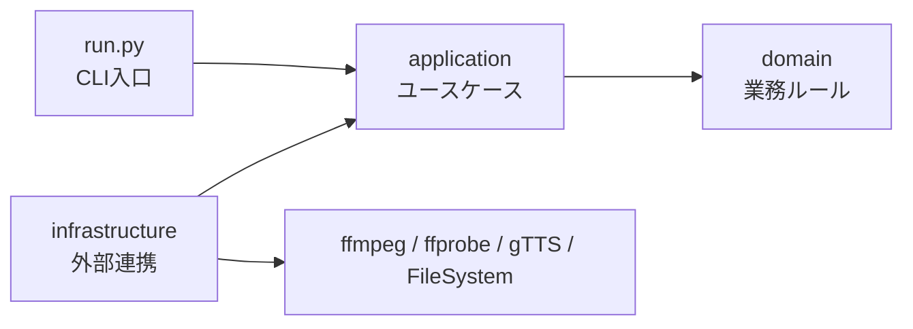

# ai-video-generator

取得済みの画像ファイルと台本JSONから、音声・字幕・動画ファイルを生成するプロダクトです。  
画像生成は行いません。

## プロジェクト構成図

```text
ai-video-generator/
├─ run.py                    # CLIの入口（引数を受け取り、処理を呼ぶ）
├─ domain/                   # 業務ルール（純粋ロジック）
│  ├─ models.py              # 設定・台本の型とバリデーション
│  ├─ video.py               # 尺調整や atempo など動画関連の計算
│  ├─ subtitles.py           # 字幕分割・時刻変換など字幕ロジック
│  └─ errors.py              # 共通エラー
├─ application/              # ユースケース（処理の流れ）
│  ├─ use_cases.py           # doctor/tts/srt/render/all/clean の本体
│  ├─ pathing.py             # パス解決（images_dir など）
│  ├─ ports.py               # 外部依存のインターフェース定義
│  └─ dto.py                 # CLIから受け取るデータ構造
├─ infrastructure/           # 外部ツール・ファイルI/O
│  ├─ container.py           # 依存注入（組み立て）
│  ├─ repositories.py        # JSON読込（config/story）
│  ├─ process_runner.py      # subprocess 実行
│  ├─ media_gateway.py       # ffmpeg/ffprobe 連携
│  └─ narration_gateway.py   # gTTS/say/espeak-ng 連携
├─ tests/                    # ユニットテスト
├─ configs/                  # 設定JSON
├─ stories/                  # 台本JSON
├─ images/                   # 入力画像
└─ outputs/                  # 生成結果
```

### 依存関係のイメージ



## 各レイヤーの役割（やさしい解説）

- `domain`
  - 「何が正しいか」を決める層です。
  - 例: 字幕の時間計算、設定値の検証。
  - 外部ツールに依存しないので、テストしやすいです。
- `application`
  - 「何を、どの順番で行うか」を決める層です。
  - 例: `all` なら `tts -> srt -> render` の順で実行。
  - `domain` のロジックと `infrastructure` の機能をつなぎます。
- `infrastructure`
  - 「外の世界とやり取りする」層です。
  - 例: ffmpeg 実行、JSONファイル読込、gTTS呼び出し。
  - ここを差し替えると、実行環境の違いに対応しやすくなります。
- `run.py`
  - ユーザー入力（CLI引数）を受け取るだけの薄い入口です。
  - 実際の処理は `application/use_cases.py` に委譲します。

## 1本の動画ができるまで

1. `run.py` がコマンド（例: `all`）と引数を受け取る
2. `application` がユースケースを開始する
3. `domain` が文字分割や時間計算などのルールを処理する
4. `infrastructure` が ffmpeg/gTTS/ファイル操作を実行する
5. `outputs/` に `output.mp4` などの成果物が出力される

## 最短手順（これだけでOK）

1. 画像を `images/` に置く  
2. 台本を `stories/<your-story>.json` に書く  
3. 実行する（Docker）

```bash
docker build -f docker/Dockerfile -t ai-video-generator-pipeline:latest .
docker run --rm -v "$(pwd):/work" -w /work ai-video-generator-pipeline:latest \
  all --config configs/config.docker.cpu.json --story stories/<your-story>.json --images-dir ../images
```

出力先:
- `outputs/docker-all/output.mp4`
  - 最終生成される動画ファイル（投稿対象）
- `outputs/docker-all/subtitles.srt`
  - 字幕テキストと表示タイミングの標準形式ファイル（確認・他ツール連携用）
- `outputs/docker-all/subtitles.ass`
  - 装飾付き字幕ファイル（アニメーションやスタイル情報を含む）
- `outputs/docker-all/audio/narration.wav`
  - 全シーンを連結したナレーション音声（動画の音声トラック元）

## 入力ファイル

- `configs/config.docker.cpu.json`（解像度、fps、TTS設定）
- `stories/story*.json`（シーンごとの画像パス・字幕文・ナレーション文）
- 画像ファイル（各シーンで `image` に指定）

## story JSON 形式

```json
{
  "title": "AWS雑学 30秒",
  "scenes": [
    {
      "id": "aws1",
      "image": "images/aws1.png",
      "on_screen_text": "AWSは2006年に本格始動",
      "narration": "AWSの本格スタートは2006年。",
      "keywords": ["AWS", "2006年", "本格始動"]
    }
  ]
}
```

- `image` は通常必須
- 音声は `narration` を使用
- 動画に焼き込む字幕は「キーワード強調表示」
  - `keywords` があればそれを優先
  - `keywords` がなければ `on_screen_text` / `narration` から自動抽出
- 相対パスは `story.json` のあるディレクトリ基準で解決
  - 例: `stories/story.aws.json` で `image: "images/a.png"` の場合、`images/a.png`（リポジトリ直下）も自動探索
- TTS は `gTTS` を使用（実行時にインターネット接続が必要）
- 字幕ON/OFFは `subtitles.enabled` またはCLIで切り替え
- 画像サイズはデフォルトで「入力画像の元サイズをそのまま使用」
  - `project.use_source_size: true`（既定）
  - この場合、全シーン画像の解像度が同じである必要があります
- 動画尺の上限を指定可能
  - `project.max_duration_sec`（秒、`0` または未指定で無制限）
  - 例: `60` を指定すると 1分以内に自動調整

動画への字幕焼き込み仕様:
- `use_source_size=true` なら入力画像サイズのまま出力
- `use_source_size=false` なら `width` x `height` へ scale/crop
- 画面中央にキーワードを大きく表示
- ポップイン + フェードアウトのアニメーション付き
- 安全マージンを確保し、文字切れを抑制

字幕切り替え:
- デフォルト: `configs/config.docker.cpu.json` の `subtitles.enabled` に従う
- 強制OFF: `--no-subtitles`
- 強制ON: `--with-subtitles`

尺の上限切り替え:
- デフォルト: `project.max_duration_sec`
- 実行時上書き: `--max-duration-sec 60`

必須パラメータ:
- `--config`
- `--story`
- `--images-dir`

`--images-dir` の挙動:
- `image` が相対パスなら `--images-dir` 基準で解決
- `image` を省略したシーンは `<id>.png` を `--images-dir` から自動解決

## 実行コマンド（Docker）

### docker run で直接実行（これのみ）

```bash
docker build -f docker/Dockerfile -t ai-video-generator-pipeline:latest .
docker run --rm -v "$(pwd):/work" -w /work ai-video-generator-pipeline:latest \
  all --config configs/config.docker.cpu.json --story stories/<your-story>.json --images-dir ../images
```

生成物のクリーンアップ:

```bash
# 指定configの out_dir だけ削除
docker run --rm -v "$(pwd):/work" -w /work ai-video-generator-pipeline:latest \
  clean --config configs/config.docker.cpu.json

# outputs/ 以下を全部削除
docker run --rm -v "$(pwd):/work" -w /work ai-video-generator-pipeline:latest \
  clean --all
```

## コマンド一覧

共通の前提:
- 通常コマンドは `--config` `--story` `--images-dir` を指定（`doctor` は `--config` のみ）
- 例の `stories/<your-story>.json` は実在ファイル名に置き換える

### 1) `doctor`
環境チェック（ffmpeg/ffprobe/TTS設定）を実行します。

```bash
docker run --rm -v "$(pwd):/work" -w /work ai-video-generator-pipeline:latest \
  doctor --config configs/config.docker.cpu.json
```

### 2) `tts`
シーンごとの音声 (`audio/<scene_id>.wav`) と連結音声 (`audio/narration.wav`) を生成します。

```bash
docker run --rm -v "$(pwd):/work" -w /work ai-video-generator-pipeline:latest \
  tts --config configs/config.docker.cpu.json --story stories/<your-story>.json --images-dir ../images
```

### 3) `srt`
字幕ファイルを生成します。`subtitles.srt` と `subtitles.ass` の両方を出力します。

```bash
docker run --rm -v "$(pwd):/work" -w /work ai-video-generator-pipeline:latest \
  srt --config configs/config.docker.cpu.json --story stories/<your-story>.json --images-dir ../images
```

### 4) `render`
画像と音声を結合して `output.mp4` を生成します。

```bash
docker run --rm -v "$(pwd):/work" -w /work ai-video-generator-pipeline:latest \
  render --config configs/config.docker.cpu.json --story stories/<your-story>.json --images-dir ../images
```

### 5) `all`
`tts -> srt(必要時) -> render` をまとめて実行します。通常はこれを使います。

```bash
docker run --rm -v "$(pwd):/work" -w /work ai-video-generator-pipeline:latest \
  all --config configs/config.docker.cpu.json --story stories/<your-story>.json --images-dir ../images
```

### 6) `clean`
生成物を削除します。

```bash
# 指定configの out_dir だけ削除
docker run --rm -v "$(pwd):/work" -w /work ai-video-generator-pipeline:latest \
  clean --config configs/config.docker.cpu.json

# outputs/ 以下を全部削除
docker run --rm -v "$(pwd):/work" -w /work ai-video-generator-pipeline:latest \
  clean --all
```

## 追加パラメータ（重要）

### 字幕ON/OFF
- `--no-subtitles`: 字幕を焼き込まない
- `--with-subtitles`: 字幕を強制的に焼き込む
- どちらも未指定の場合: `configs/config.docker.cpu.json` の `subtitles.enabled` を使用

例（字幕なし）:
```bash
docker run --rm -v "$(pwd):/work" -w /work ai-video-generator-pipeline:latest \
  all --config configs/config.docker.cpu.json --story stories/<your-story>.json --images-dir ../images --no-subtitles
```

例（字幕あり）:
```bash
docker run --rm -v "$(pwd):/work" -w /work ai-video-generator-pipeline:latest \
  all --config configs/config.docker.cpu.json --story stories/<your-story>.json --images-dir ../images --with-subtitles
```

### 動画尺の制御
- `--max-duration-sec <秒>`: 実行時に最大尺を上書き
- 未指定の場合: `config` の `project.max_duration_sec` を使用
- 例: `--max-duration-sec 60` で1分以内

例（1分上限）:
```bash
docker run --rm -v "$(pwd):/work" -w /work ai-video-generator-pipeline:latest \
  all --config configs/config.docker.cpu.json --story stories/<your-story>.json --images-dir ../images --max-duration-sec 60
```

### よく使う組み合わせ（字幕なし + 1分）
```bash
docker run --rm -v "$(pwd):/work" -w /work ai-video-generator-pipeline:latest \
  all --config configs/config.docker.cpu.json --story stories/<your-story>.json --images-dir ../images --no-subtitles --max-duration-sec 60
```
